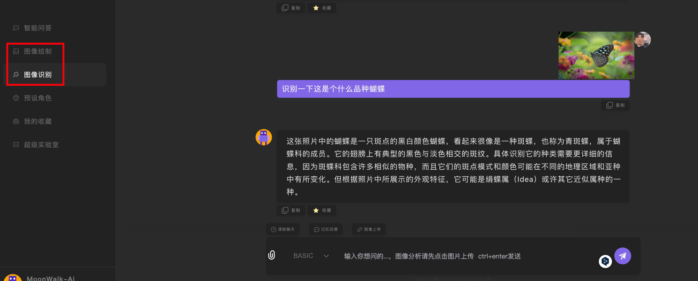

# TIME-SEA-PLUS

# 新版本为 SpringCloudAlibaba 全新UI全新功能 版本 仓库 Deep Sea

基于 SpringBoot3 开发的 Ai 多功能项目,支持(H5,Web,微信小程序) 此项目为长期维护更新项目 有什么问题可以直接在微信群问或者留下你的 issues
两个端 可自行选择性部署 也可两个都部署(推荐做法)

每个分支都用不同的功能 选择自己喜欢的 master为默认版本分支 woo-cloud与 old_ye 对与Ai绘画部分做了更丰富的功能(额外接入Python SDK) 
## preview分支
- 提供了图像识别和图像绘制功能，当然，你也可以在智能问答中输入/image 要求ai画一张图
- 相比master分支需要新增preview_images表


[](<[https://www.github.com/novicezk/midjourney-proxy](https://github.com/dulaiduwang003/TIME-SEA-PLUS)>)
[](https://www.apache.org/licenses/LICENSE-2.0.html)

## 一键部署
`一定一定先把各端配置文件修改完成`
- java项目 修改src/resources/application-docker.yml文件
- java项目 src/resources/目录放置pfx证书文件
- web项目 修改.env.production配置文件
- web项目 替换crt文件夹中的证书密钥
- web项目 修改super_web.conf里的域名
- 项目根目录 修改docker-compose.yml文件第20行数据库密码
- 项目根目录 修改redis.conf文件第790行redis密码
```
# 第一步，初始化环境
sh init.sh # 根据系统选择1或者是2
# 第二步，部署
sh init.sh # 选择3
# 备注
如果之前有数据数据的，执行脚本选择4，然后将备份文件(在/root根目录中)存在本地，可卸载mysql和redis或者直接重装系统，等部署完后再导入
```

## 如果你不喜欢一键部署方式 请按照以下视频部署(喂饭级)
视频地址:  https://www.bilibili.com/video/BV1E8411v7fr/

视频所用的笔记:
https://note.youdao.com/s/QY9qWQv

后端部署图文(可以看看)
https://note.youdao.com/s/MZgdKiEl 

小程序部署图文(可以看看)
https://note.youdao.com/s/W2Et1NXD

web部署太简单了 跟着视频来就行

#### 快速体验

##### 小程序 演示


` preview分支 演示`
https://font.TIME-SEA-PLUS-ai.com.cn/

` web 演示`

https://anchwngb.cn

` Web 备用站点`

https://chat.yycld.com

### 主要功能以及特性

` Web 和 小程序 共用一个后端 数据全一致 ps 如果需要网页的微信扫一扫登录则必须部署小程序应用 小程序和web都有控制台配置`

- 新增小程序主界面隐藏控制机制
- 微信扫码登录
- 网页支持邮箱注册登录
- 网页新增 控制台
- 黑夜/日间 主题切换
- Web 主要 GPT 对话形式更改为 与小程序相同
- 小程序对话记忆(历史对话记录)
- Web 对话记忆(历史对话记录)
- 超级实验室功能 (含绘图功能 NewBing claude 免费GPT)
- Web 拓展
- 对话暂停(双端支持)
- 支付宝支付(仅 Web)
- GPT 流对话
- 对话功能收藏功能 以及 收藏对话回溯场景 (双端支持,回溯目前只支持小程序)
- 支持 GPT 自定义敏感词拦截 以及 微信铭感词拦截 (web 暂时无拦截 , 小程序支持任意拦截)
- SD MJ 文生图 图生图 (绘图功能仅小程序支持,web 仅有 SD绘图)
- 支持用户自定义头像昵称(小程序设置后 web 同步)
- 支持自定义 GPT 预设词功能版块(无限制定义)
- 项目工件模块化
- Ai 币兑换码 (也可通过观看广告获得 也可通过支付宝充值)
- 创意广场(允许将优秀个人作品展示至鉴赏 所有用户可视)
- 支持 GPT 对话暂停输出以及继续输出
- 内置后台管理 (用户管理 绘图管理 服务器管理 兑换码管理)
- 接入百度翻译 API
- 绘图类 API 列队处理
- 微信作品制作通知
- 数据懒异步处理
- 支持主流语言以及配置类 代码高亮
- 查看广告获得次数
- 发布公告(双端同步)

## 部署环境

`百度翻译`
`阿里OSS`
`微信开发者平台APPID及密钥`
`JDK17`
`SD API`
`MJ API`
`Redis 7`
`MySQL 8`
`微信开发中工具`

`项目部署时一定要先在本地部署一遍 如果不会部署 请联系作者微信:SeatimeIsland `
`后端部署不挑环境 硬性要求为 MYSQL8 Redis7 JDK17即可 `
`前端代码直接使用微信开发者工具打开 请使用导入功能`
`另外可以进微信群 一起讨论项目部署 或者 以及其他编程学术类问题` 
`部署问题请在群里提问 代码问题业务问题才向群主反馈`


`在uniApp根目录中执行以下命令`

```
npm install
```

`前端配置在于 uitls/env.js中 可用VSCODE 或者 Websotrm 或 HBuilder动态修改`


`注意把manifest.json中的 appid替换为自己的微信APPID`


`如何运行到微信开发者小程序呢? 使用HBuilder打开此项目 如何随便点击里面一个文件(必须,否则Hbuider无法识别项目)`


`使用HBuilder打开源码后如图所示(此图操作只是运行到微信小程序,如果通过这种方式上传到微信小程序正式版 代码包是没有压缩的,所以如果你要发布正式版本则选择发行按钮 跟着操作来就行,另外再发行前 请先把原有的unpackage目录删除 再点击发行 之后就可以上传至体验或者正式,如果你只需本地调试则 直接运行即可)`


`请注意在微信公众平台中 把https wss 阿里oss域名 开启白名单校验`

如需二开项目请注意遵循开源规则 个人开发不易 如果你喜欢这个项目 请你动动小手给此项目点个 star 吧 😁 欢迎各位大佬一起维护此项目

请作者喝一杯 coffee😁


## 关于请求 429 问题

这是上游的频率控制，触发条件有文本量以及请求次数。
可以借助 oneAPI 项目统一 token 和请求地址。
这里附上简单的 docker 容器执行命令

##### docker 命令

```
docker run --name one-api -d --restart always -e REDIS_CONN_STRING=redis://default:@localhost:6379/8  -e SESSION_SECRET=xiaoye123 -e  SQL_DSN="oneapi:7KF4KccCs@tcp(localhost:3306)/oneapi"  -e NODE_TYPE=master  -e  CHANNEL_UPDATE_FREQUENCY=1440  -e CHANNEL_TEST_FREQUENCY=1440  -e POLLING_INTERVAL=5  -e BATCH_UPDATE_ENABLED=false  -e GLOBAL_API_RATE_LIMIT=180000  -e GLOBAL_WEB_RATE_LIMIT=50000    -e SYNC_FREQUENCY=60  --network="host" -p 3000:3000 -v /www/wwwroot/oneapi:/data ghcr.io/songquanpeng/one-api:v0.5.5-alpha.4

```

##### oneAPI docker 部署参数简要说明

需要修改的变量：

1. REDIS_CONN_STRING
2. SQL_DSN

```
# 容器名称
--name one-api

# redis地址  redis://默认用户:密码@redis数据库IP:redis的端口/redis数据库索引
# 注意一般没有修改过redis的用户，默认就是default，没有密码就写成“default:”，有密码password就写成“default:password”
-e REDIS_CONN_STRING=redis://default:@localhost:6379/8

#项目密钥 多机部署用
-e SESSION_SECRET=xiaoye123

# 指定数据库地址 数据库用户名：数据库密码@tcp(数据库IP:数据库端口)/数据库名
-e SQL_DSN="oneapi:7KF4KccCs@tcp(localhost:3306)/oneapi"

# 没细看,多机部署是否为主节点
-e NODE_TYPE=master

# 没细看
-e CHANNEL_UPDATE_FREQUENCY=1440

# 没细看
-e CHANNEL_TEST_FREQUENCY=1440

# 没细看
-e POLLING_INTERVAL=5

# 没细看
-e BATCH_UPDATE_ENABLED=false

# API请求三分钟内的频率限制
-e GLOBAL_API_RATE_LIMIT=180000

# web请求三分钟内的频率限制
-e GLOBAL_WEB_RATE_LIMIT=50000

# 没细看
-e SYNC_FREQUENCY=60

# 是否使用宿主机的网络， 必须，这样独立服务器才可以用上宿主机的redis和mysql
--network="host"

# docker 容器 内外端口映射
-p 3000:3000

# docker 容器 内外路径映射
-v /www/wwwroot/oneapi:/data

# 镜像名称， 这里用的是群友推荐的， 这里的":v0.5.5-alpha.4"理解的朋友可以去掉。
ghcr.io/songquanpeng/one-api:v0.5.5-alpha.4

```

` 后端部署参考笔记 https://note.youdao.com/s/MZgdKiEl`
` 小程序部署参考笔记 https://note.youdao.com/s/W2Et1NXD`
` web部分太简单了 npm install 之后修改env配置打包上传即可 `

## web 端 todo

- 完善 B 站喂饭级别教程
- [完成]完善 docker 镜像，以及快速部署教程
- [完成]密码重置
- [完成]移动端管理员页面兼容适配
- [完成]后期接口请求，支持用户上传提示词
- [完成]为每个对话设置系统 Prompt
- [完成]允许用户自行编辑内置 Prompt 列表
- [完成]预制角色：使用预制角色快速定制新对话
- [完成]脚本部署，争取做到半自动或者开箱即用
- 推进服务端部署 LocalAI 项目 llama / gpt4all / rwkv / vicuna / koala / gpt4all-j / cerebras / falcon / dolly 等等，或者使用 api-for-open-llm
- [完成] oneAPI 项目，可以提高请求的频率
